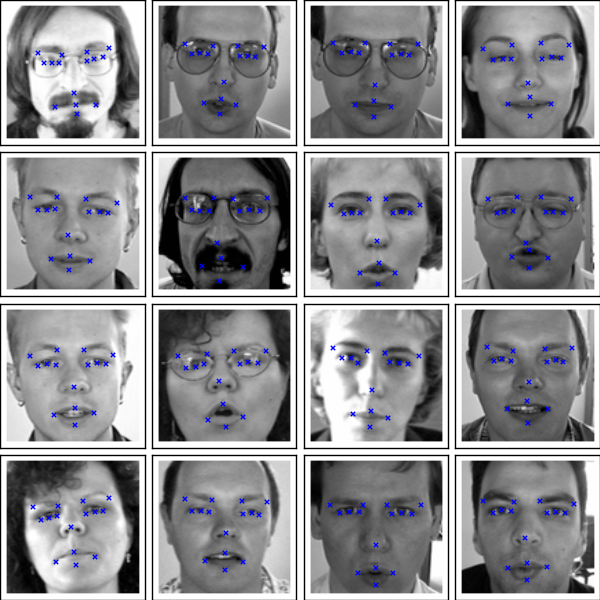

# caffe-regression
caffe-regression examples ,kaggle face keypoint detection 

data folder

the data process code are mainly from

http://danielnouri.org/notes/2014/12/17/using-convolutional-neural-nets-to-detect-facial-keypoints-tutorial/

seperate data as train,val,test

prototxt folder

caffe net.prototxt, solver.prototxt, deploy.prototxt and a trained caffe model

prediction folder

test the trained caffe model

current result

